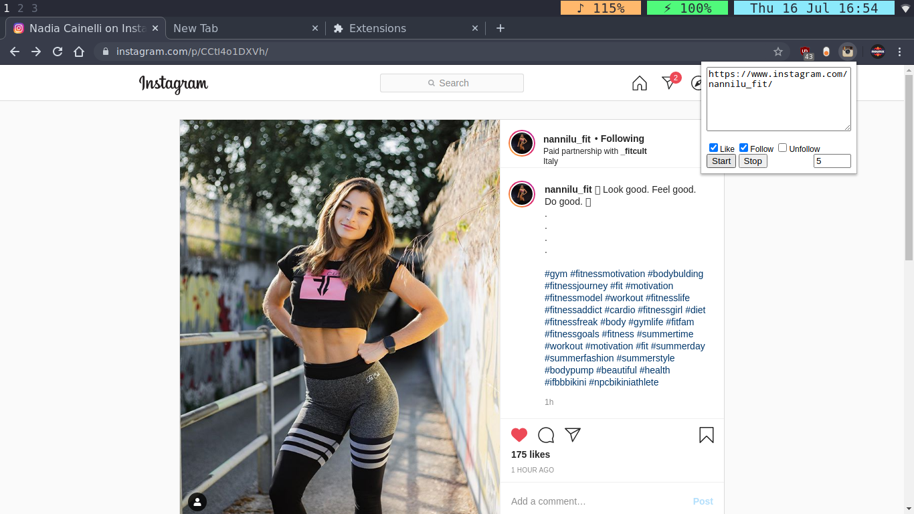

# Instagram bot

This Chrome extension automatically likes posts and follows sites.

# Not working anymore!!!

# Follow & Like
1. Search for an hashtag for eg. "#gym"
2. Click on a post
3. Choose ur options "like" or "follow" in the extension menu
    - If u choose "follow", then every followed site will be saved
        in the box, so at the end u can copy that list and unfollow everyone
        after some time.
4. (Optional) Choose an interval in the extension menu
5. Press "Start"

# Unfollow
1. Paste the list of the followed sites into the box
2. Check "unfollow"
3. Press "Start"

# Sample

## License
This Project is released under GNU GPLv3 licence. Copyright (c) Martin Muenning.